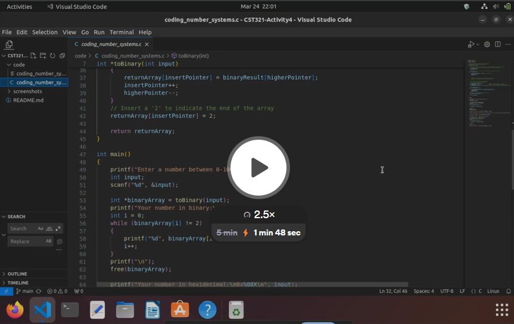

# CST321-Activity4
This C program demonstrates how to convert a decimal number to binary and applies a bit shift operation.

Binary Conversion:
The toBinary function takes an integer input and converts it into a binary representation stored in an integer array. Here's how it works:

- It iteratively divides the input number by 2 and stores the remainder (0 or 1) in an array.
- After each division, the input is updated to the quotient.
- The array is then reversed to get the correct binary representation.

Converting to hexadecimal:
```printf("New number in hexadecimal:\n0x%08X\n", result);```
%08X: Specifies that the output should be formatted as a hexadecimal number padded with zeros to a width of 8 characters.
0x: Prefixes the hexadecimal number with "0x" to indicate its base.

Bit Shift Operation:
After converting the input to binary, the program performs a left shift operation.

```int result = ((input << 10) & 0xFFFFFC00) | 0x03FF;```

input << 10: Left shifts the binary representation of the input by 10 bits.
& 0xFFFFFC00: Masks out the lower 10 bits, leaving only the upper 22 bits unchanged.
| 0x03FF: Logically ORs the result with 0x03FF, which sets the lower 10 bits to 1.

[](https://www.loom.com/share/c70697f0bafc44f1ade8454a15c76d6c?sid=4038f36e-5ba6-4ffb-838a-ef145edb25d3)
